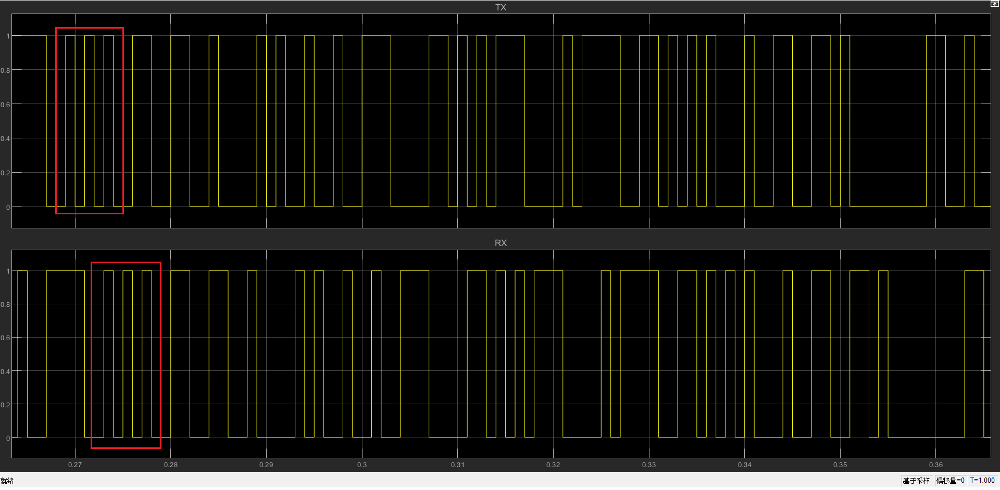
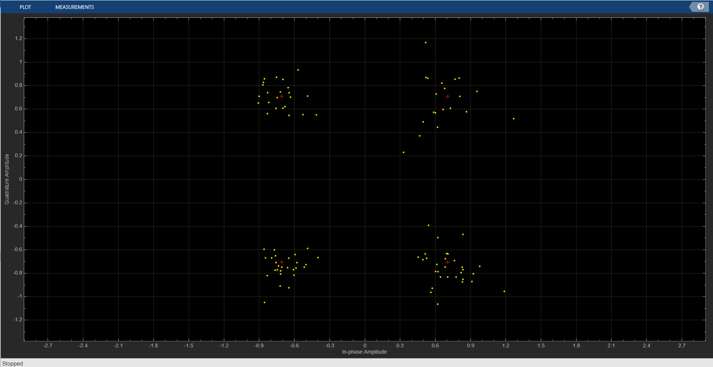
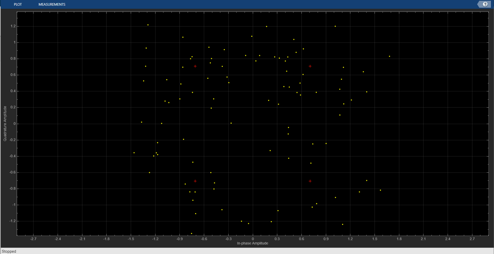
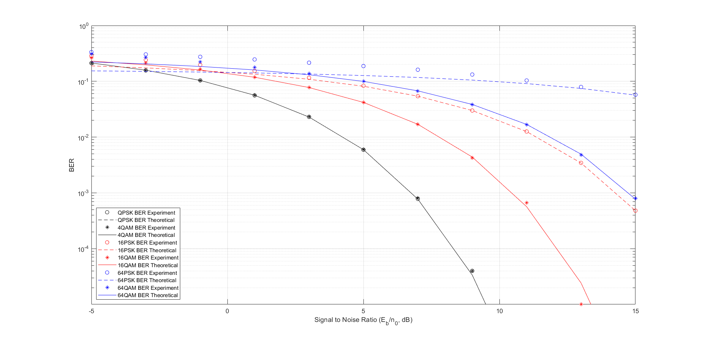
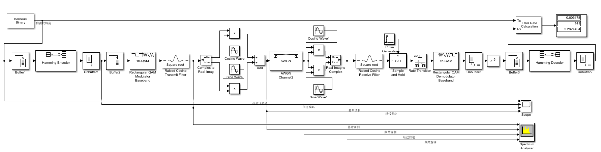
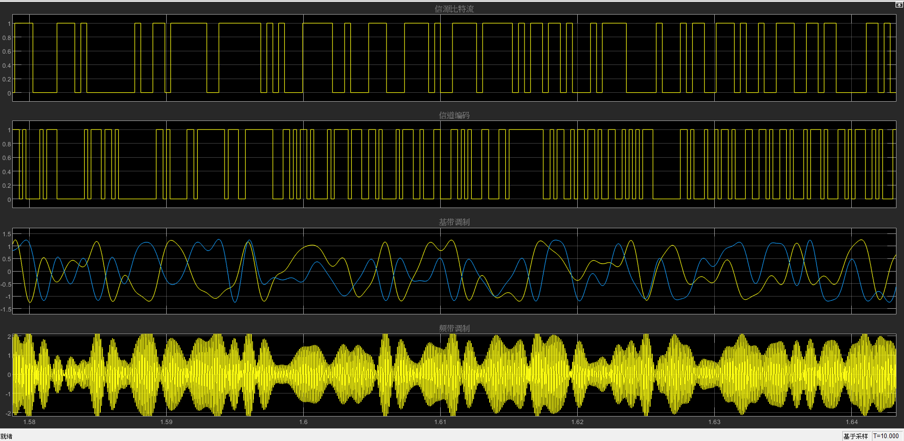
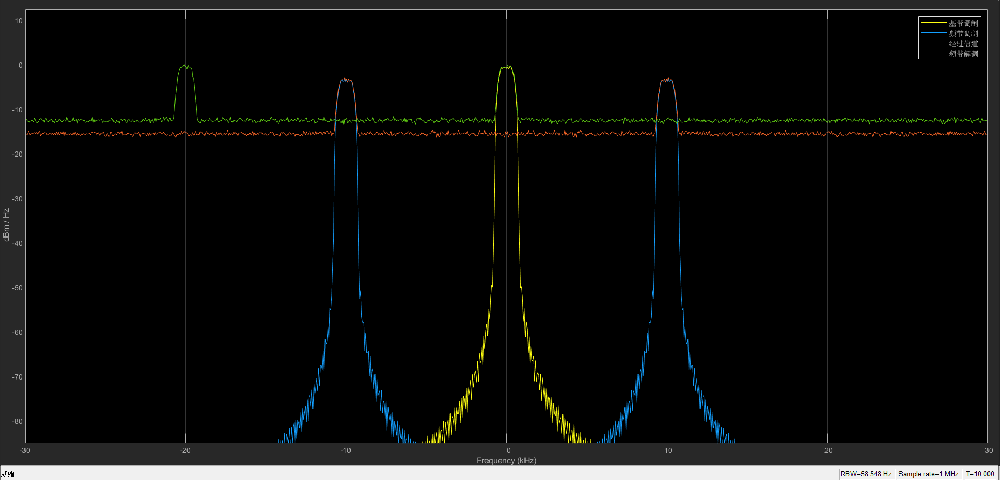

### 实验八 载波传输实验

#### 一、多进制相位偏移调制（M-PSK） 

##### a）搭建模型

.png)

​	由Power Meter测量输入信号功率为1，验证了此实验中的频带调制不改变信号功率

##### b）观察频带调制与解调信号

###### 1）载波调制解调过程

载波调制解调.png)

​	较短一段时间内的发送基带信号(TX Baseband)、发送频带调制信号(TX Waveform)、频带解调过程信号 (Passband Demodulating)和基带解调过程信号（Baseband Demodulating）

​	调制：buffer将Bernoulli Binary Generator产生的随机bit每两位输出一次，采用QPSK调制，发送基带信号共四种类型，实虚部取值$±\frac{\sqrt2}{2}$, 对应辐角分别是$\frac{1}{4}\pi$, $\frac{3}{4}\pi$, $-\frac{3}{4}\pi$和$-\frac{1}{4}\pi$。经过Complex to Real-Imag 模块将实虚部分开，分别乘上余弦波和正弦波并叠加作为发送信号。

​	解调：AWGN信道注释直通，加法器的输出分别乘上和调制中相同的余弦波与正弦波并通过Real-Imag to Complex 模块合成一个复数，通过Moving Average 模块进行匹配滤波。

​	图中三段基带信号分别是$-\frac{\sqrt2}{2}+\frac{\sqrt2}{2}i$, $-\frac{\sqrt2}{2}-\frac{\sqrt2}{2}i$和$-\frac{\sqrt2}{2}+\frac{\sqrt2}{2}i$， 对应辐角是$\frac{3}{4}\pi$, $-\frac{3}{4}\pi$和$\frac{3}{4}\pi$。得到图中的TX Passband波形。TX Passband波形分别乘上调制时的余弦波和正弦波作为实部和虚部合成复数，之后通过移动平均模块对符号区间内的信号进行平均。图中Baseband Demodulating信号和TX Baseband信号基本一致，只是移动平均过程使得波形变化相较方波变化更为平缓。

###### 2）待调制复电平与载波相位的对应关系及$f_c$ 和$\theta$ 的数值

观察复电平与载波相位_0.25pi.png)

待调制的复电平：$\frac{\sqrt2}{2}+\frac{\sqrt2}{2}i$

载波相位：$\frac{1}{4}\pi$

观察复电平与载波相位_-0.25pi_-0.75pi.png)

待调制的复电平：$\frac{\sqrt2}{2}-\frac{\sqrt2}{2}i$, $-\frac{\sqrt2}{2}-\frac{\sqrt2}{2}i$

载波相位：$-\frac{1}{4}\pi$, $-\frac{3}{4}\pi$ 

观察复电平与载波相位_0.75pi.png)

待调制的复电平：$-\frac{\sqrt2}{2}+\frac{\sqrt2}{2}i$

载波相位：$\frac{3}{4}\pi$ 

_fc.png)

​	图中经过$0.5ms$，载波波形经历五个周期，因此载波频率$f_c=10kHz$。由于载波由两个频率为$10kHz$ 但相位不同的正弦波合成得到，理论上的载波频率也是$10kHz$，测量和理论值相符。

​	设复电平的辐角是$\theta_k$, 则TX Passband的信号形式是$cos(\theta_k)cos(2\pi f_ct+\theta)-sin(\theta_k)sin(2\pi f_ct+\theta)=cos(2\pi f_ct+\theta+\theta_k)$。对比得$\theta=0$

###### 3）观察记录发送比特流与判决比特流的延时



​	由图中标示两处位置可知判决比特流相较发送比特流延迟4个采样点。Buffer和Moving Average 模块各引起k个单位的延时，总延时是$2*k=4$个采样点，和测量结果一致。

##### c）观察频带调制与解调功率谱

_图例.png)

​	频带调制信号由基带信号乘上载波得到，乘cos对应频谱一分为二向正负$f_c$ 搬移，图中TX Passband 功率谱由基带信号功率谱向$±10kHz$ 搬移，峰值约下降$3dB$ 。频带解调过程信号由频带调制信号乘$\sqrt{2}cos(2\pi f_ct)+j\sqrt{2}sin(2\pi f_ct)=\sqrt{2}e^{j2\pi f_ct}$ 得到，对应功率谱向负频率方向搬移$f_c=10kHz$。基带解调过程信号由频带解调过程信号经过Moving Average 模块得到，相当于经过低通滤波器，因此功率谱中的高频分量被抑制，低频分量得以通过。

##### d）观察 MPSK 接收星座图



​	$\frac{E_b}{N_0}=10dB$ 时接收星座点分布



​	$\frac{E_b}{N_0}=0dB$ 时接收星座点分布

##### e）对比复电平等效信道并记录误符号率

###### 1）模型搭建

_模型.png)

###### 2）运行仿真并记录误比特率

.png)

​	仿真结果，上方是误比特率，下方是复电平等效的误比特率

| **$E_b/n_0$**        | -5     | 0       | 5        |
| -------------------- | ------ | ------- | -------- |
| **误比特率 $P_b$**   | 0.2115 | 0.07502 | 0.005402 |
| **复电平等效 $P_b$** | 0.2153 | 0.08391 | 0.006001 |
| **理论值 $P_b$**     | 0.2132 | 0.07865 | 0.005954 |

​	其中QPSK 的误比特率与信噪比$E_b/n_0$ 的理论关系：$P_b=\frac{2}{log_2 M}Q(sin\frac{\pi}{M}\sqrt{2\log_2 M\frac{E_b}{n_0}})$

​	QPSK的实验测量误比特率、复电平等效的误比特率以及QPSK的理论误比特率基本一致，说明QPSK理论误比特率推导的正确性以及复电平等效的合理性。

#### 二、复电平映射方式对比

##### a）搭建模型

_模型.png)

##### b）观察不同符号映射的接收星座图

###### 1）16-PSK

_16PSK_SNR_20.png)

​	$E_b/n_0=20dB$

_16PSK_SNR_10.png)

​	$E_b/n_0=10dB$

###### 2）16-QSK

_16QAM_SNR_20.png)

​	$E_b/n_0=20dB$

_16QAM_SNR_10.png)

​	$E_b/n_0=10dB$

直观上16-QSK方案抗噪声性能看起来更好，因为星座图各个点堆的距离更大，更不容易错判成其他符号。

##### c）绘制误符号率曲线

```matlab
 ber_psk_th(i,j) = 2/log2(M)*qfunc(sin(pi/M)*sqrt(2*log2(M)*(10^(SNR/10))));% TODO
 ber_qam_th(i,j) = 4/log2(M)*(1-1/sqrt(M))*qfunc(sqrt(3*log2(M)*(10^(SNR/10))/(M-1)));% TODO
```

​	在循环中添加理论误比特率的计算部分。

​	其中$P_b^{QAM}=\frac{4}{log_2 M}(1-\frac{1}{\sqrt{M}})Q(\sqrt{\frac{3\log_2 M}{M-1}\frac{E_b}{n_0}})$

​	$P_b^{PSK}=\frac{2}{log_2 M}Q(sin\frac{\pi}{M}\sqrt{2\log_2 M\frac{E_b}{n_0}})$



​	上图为绘制出的误符号率曲线。64-PSK在$E_b/n_0<10$ 时理论值与实际曲线出现明显偏差，16-PSK在$E_b/n_0<0$ 时出现明显偏差。因为PSK的理论误比特率在推导时只考虑了错成相邻符号的情况，在信噪比很高和M较小的情况下错到不相邻符号的概率很小，但在信噪比降低和M增大的情况下错到不相邻符号的可能性越来越大，使得实验测量的误比特率高于理论误比特率。

#### 三、综合实验：完整通信系统搭建

##### a）搭建模型



Bernoulli 信源的周期设置为$\frac{n*10^{-3}}{k*log_2 M}$，其中$n=7,k=4,M=16$，符号率$2.29kbps$

信道编码：选用 (7,4) Hamming 码进行信道编码。

符号映射：选用 16-QAM 作为映射方式。

##### b）波形记录



##### c）功率谱记录



#### 四、思考题

##### 	1.将频带传输等效为复电平信道需要哪些理想假设？请尽可能多列举。 

​	两路载波信号正交；通带内噪声功率谱平坦；匹配滤波器理想；基带信号严格带限。


##### 	2.在完成了通信部分的实验后，你有什么收获和建议

​	完成了通信部分的实验后我对Simulink的基本使用有了一些了解，能够使用Simulink搭建简单的通信模型。

​	希望之后的通信实验能够在网络学堂上提供基础的没有更改参数的Simulink模型文件，在完成通信部分四个实验的过程中，本人搭建模型的部分就是单纯按照指导书的参考图片从库浏览器拉模型进行搭建，我认为这个过程对加强理解学习过的知识并没有本质的帮助，而根据实验要求修改各个模型的参数和实验的关系更密切一些。