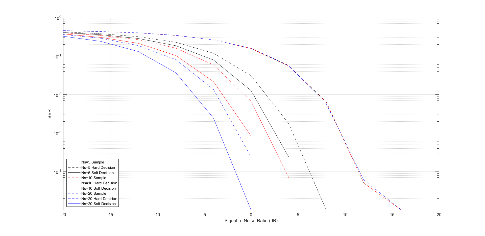
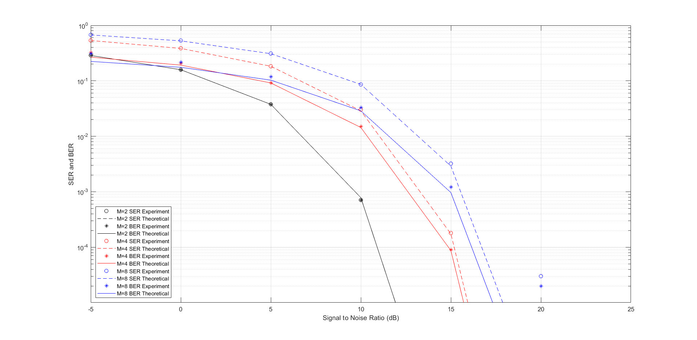

### 实验六 电平判决实验

#### 一、AWGN电平信道与二元符号判决

##### 	a）搭建模型


##### 	b）观察AWGN信道对二元电平信号的影响


​	较短时间内AWGN信道对二元电平信号的影响

##### 	c）记录二元符号AWGN信道误符号率


​	仿真结果

| **信号功率 $E_s$**         | $1$      | $1$       | $1$      | $1$             | $1$              |
| -------------------------- | -------- | --------- | -------- | --------------- | ---------------- |
| **噪声功率 $σ^2$**         | $1.025$  | $0.4938$  | $0.2517$ | $0.09067$       | $0.009915$       |
| **信噪比 $E_s/σ^2  (dB)$** | $-0.107$ | $3.064$   | $5.870$  | $10.425$        | $20.037$         |
| **误符号率 $P_e$**         | $0.1617$ | $0.07949$ | $0.026$  | $0.0004$        | $0$              |
| **理论信号功率**           | $1$      | $1$       | $1$      | $1$             | $1$              |
| **理论噪声功率**           | $1$      | $0.49$    | $0.25$   | $0.09$          | $0.01$           |
| **理论误符号率 $P_e$**     | $0.1616$ | $0.0774$  | $0.0247$ | $4.485×10^{-4}$ | $4.943×10^{-24}$ |

​		其中误符号率关于信噪比的理论关系：$P_e=Q(\sqrt{\frac{E_s}{σ^2}})$

​		测量到的信号功率和理论信号功率完全一致；噪声测量功率和理论功率偏差不超过$3.52$%；误符号率的实验测量值和理论值基本一致。

#### 二、AWGN波形信道预习

##### 	a）采样判决


​	较短时间内AWGN波形信道对矩形脉冲信号的影响

##### b）硬判决 软判决


​	模型构建

```matlab
function y = hard(x)
if sum(x)>0
    y=1;
else 
    y=-1;
end
```

​	硬判决模块，由于判决结果是1或-1，判断哪种结果多只需要求和看结果正负即可。

##### c）仿真研究采样次数$N_s$与抗噪声性能的关系


​	仿真结果

| **信号功率 $E_s$**         |          | $1$       |           |
| -------------------------- | -------- | --------- | --------- |
| **噪声功率 $σ^2$**         | $4.0$    | $1.0$     | $0.25$    |
| **信噪比 $E_s/σ^2  (dB)$** | $-6.021$ | $0$       | $6.021$   |
| **采样速率**               |          | $N_s=5$   |           |
| **采样判决 $P_b$**         | $0.3076$ | $0.1569$  | $0.02259$ |
| **硬判决 $P_b$**           | $0.1749$ | $0.03084$ | $0.00018$ |
| **软判决 $P_b$**           | $0.1331$ | $0.01257$ | $0.00001$ |
| **采样速率**               |          | $N_s=10$  |           |
| **采样判决 $P_b$**         | $0.3098$ | $0.1586$  | $0.02254$ |
| **硬判决 $P_b$**           | $0.1087$ | $0.00738$ | $0$       |
| **软判决 $P_b$**           | $0.057$  | $0.00089$ | $0$       |

##### d）误比特率曲线绘制

```matlab
sigma2 = 1/SNR^2;% TODO
```

添加上述语句后运行脚本得到误比特率曲线图



| 判决方法 | $Ns=10$时$BER<=0.01$的最低信噪比$(dB)$ |
| -------- | -------------------------------------- |
| 采样判决 | $-1.738$                               |
| 硬判决   | $-6.150$                               |
| 软判决   | $-7.914$                               |

​	比较像素个数得到上述信噪比数值，此种情况下软判决相对于硬判决的信噪比增益是$1.764dB$，相比于采样判决信噪比增益是$6.176dB$

#### 三、多元符号判决

##### a）搭建Bit to Symbol模块


##### b）自定义Matlab函数实现最小距离判决

```matlab
function y = decision(x,A,k)
num=round(x/A);%离x/A最近的整数
if mod(num,2)==0
    num=num+2*(x/A>num)-1;
end

if num>2^k-1
    y=(2^k-1)*A;
elseif num<-(2^k-1)
    y=-(2^k-1)*A;
else
    y=num*A;
end
```

​	首先找到离$x/A$最近的整数，接着找到离$x/A$最近的奇数。如果离得最近的奇数大于$M-1$或者小于$-(M-1)$，相应的取这个整数为$M-1$或$-(M-1)$。这个整数乘上幅度$A$即为判决结果。

##### c）搭建Symbol to Bit模块


##### d）绘制M元符号AWGN信道曲线


​	模型整体

```matlab
sigma2 = ((2^2*k-1)/3*A^2)/SNR^2;% TODO
ser_th(i,j) = (2^(k+1)-2)/(2^k)*qfunc(A/sigma2^0.5);% TODO
ber_th(i,j) = (2^(k+1)-2)/(k*2^k)*qfunc(A/sigma2^0.5);% TODO
```

​	用到的理论公式：$σ^2=\frac{(M^2-1)A^2}{3(\sqrt{\frac{E_s}{σ^2}})^2}$

​							  	$P_e=\frac{2(M-1)}{M}Q(\frac{A}{\sigma})$

​							  	$P_b=\frac{2(M-1)}{Mlog_2M}Q(\frac{A}{\sigma})$

添加上述语句后运行脚本得到$SER、BER$曲线图



​	图中$M=8$，信噪比$=20dB$的情况下误比特率和误符号率和理论值有明显偏差，其余位置理论实验符合得很好。偏差处对应的$BER≈2×10^{-5}$、$SER≈3×10^{-5}$。实验时间$=10^5$，换算下来平均错了$2 bit$，$3$个符号，是非常少的错误量。由于实验时间离散，得到的$SER、BER$最小的非零值也是$10^{-5}$量级，因此实验值会和理论值有所偏差。

#### 四、思考题

1. 为什么 5.2a 中脉冲发生器的相位延迟大于 0 时会导致采样保持、速率转换后输出信号 延时 1 个采样？（提示：用示波器观察脉冲信号和采样保持信号）

   **答：**

   

   ​	四个位置的信号

   

   ​	相位延迟为0的脉冲和相位延迟非0的脉冲	

   ​	若脉冲发生器的相位延迟不为0，则速率转换时的第$i$个采样脉冲会抽取到第$i-1$个脉冲发生器产生的脉冲抽样保持的值，因此造成1个采样的延时。如果相位延迟是$Ns$的整数倍，等同于抽样保持的前几个点都抽到了0，会使得$P_e$略微升高但不会造成后续点的延时。

2. 请推导证明最大似然判决等同于 $N_s$ 个采样平均值的最小距离判决。 （提示：利用每个采样的独立性计算似然函数） 

   **答：**$P_r(y=r|x=1)=\prod_{i=1}^{N_s}(\frac{1}{\sqrt{2\pi}\sigma}e^{-\frac{(y_i-1)^2}{2}}dy_i)$

   ​	同理可得$P_r(y=r|x=-1)=\prod_{i=1}^{N_s}(\frac{1}{\sqrt{2\pi}\sigma}e^{-\frac{(y_i+1)^2}{2}}dy_i)$

   ​	将连乘展开后得到

   ​	$P_r(y=r|x=1)=\frac{1}{(\sqrt{2\pi}\sigma)^{N_s}}e^{-\frac{\sum_{i=1}^{N_s}y_i^2+N_s-2\sum_{i=1}^{N_s}y_i}{2}}dy_1dy_2...dy_{N_s}$

   ​	$P_r(y=r|x=-1)=\frac{1}{(\sqrt{2\pi}\sigma)^{N_s}}e^{-\frac{\sum_{i=1}^{N_s}y_i^2+N_s+2\sum_{i=1}^{N_s}y_i}{2}}dy_1dy_2...dy_{N_s}$

   ​	区别只在e指数项，当$2\sum_{i=1}^{N_s}y_i>-2\sum_{i=1}^{N_s}y_i$，

   即$\sum_{i=1}^{N_s}y_i>0$时，$P_r(y=r|x=1)>P_r(y=r|x=-1)$；

   当$\sum_{i=1}^{N_s}y_i=0$时，$P_r(y=r|x=1)=P_r(y=r|x=-1)$；

   当$\sum_{i=1}^{N_s}y_i<0$时，$P_r(y=r|x=1)<P_r(y=r|x=-1)$。因此最大似然判决等同于 $N_s$ 个采样平均值的最小距离判决。

3. 如果在多元符号映射时不采用格雷映射会有什么后果

   **答：**格雷映射的优点是相邻的符号只差$1bit$，由于符号出错成相邻的符号概率是最大的，采用格雷映射即使符号出错也很大概率只错一个比特。如果不采用格雷映射，会增大符号出错到相邻符号时的错误比特数，进而增大$BER$。